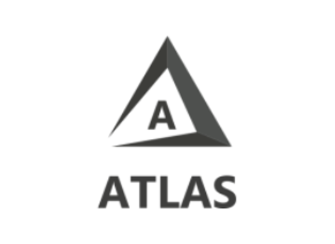
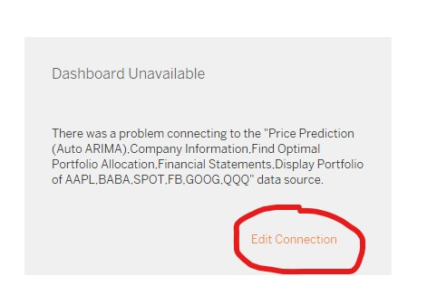
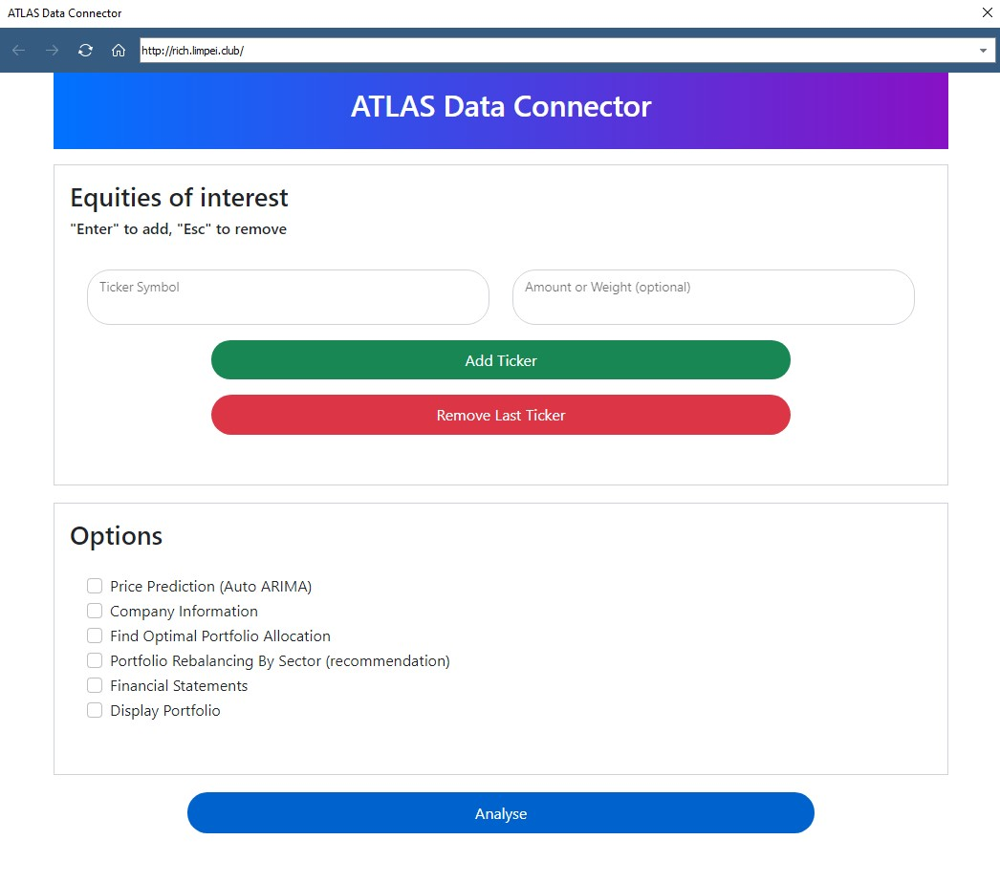
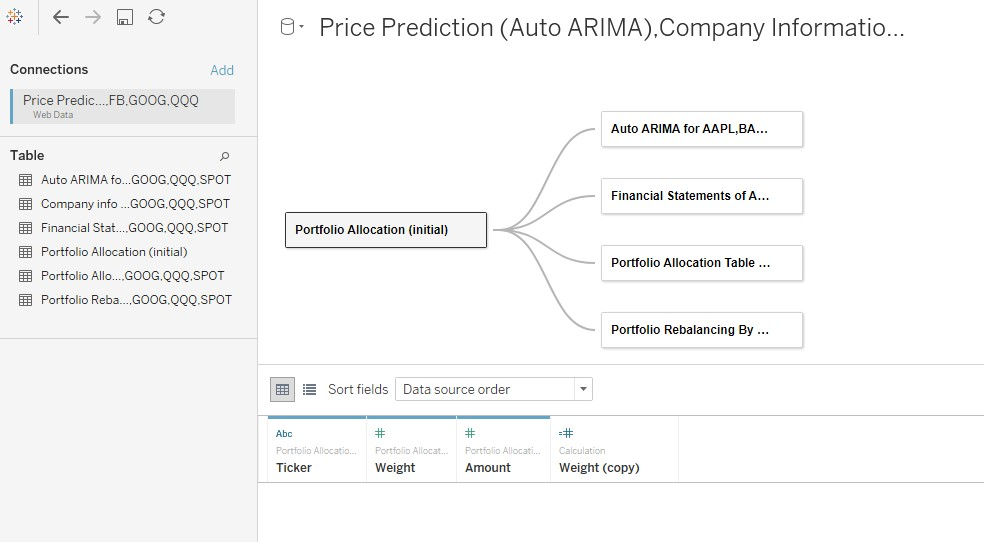
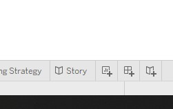

# ATLAS Analysis Servers
 For SMU IS453 Project submission



 This repository contains the various backend services for various analytical solutions.

 Up till December 20th, 2021, this solution will be deployed on the cloud and will be accessible via http://rich.limpei.club.

 ### Important Notes
* Our LSTM price forecast model is not deployed. Click [here](./services/reference/V1-LSTM_StockMarketPrediction.ipynb) to see our exploration into LSTM.
* Accompanying this repository is a [15 page report](FA_ProjectReport_G1T8.pdf) on this project.
## Getting started

1. Clone this repository 
2. Change to project directory 
```bash 
git clone https://github.com/chanyaoying/ATLAS-Analysis-Servers.git
cd ATLAS-Analysis-Servers
```
### Prerequisites
1. Docker, Docker-Compose
2. Python 3
3. Tableau (full version)


## Installation
If you want to run the backend services on your local machine, run Docker Compose
```bash
docker-compose up
```
## Usage
If you are running the backend services, the Web Data Connector (WDC) is accessible at http://localhost:80.

If not, it will be live on http://rich.limpei.club.

1. Launch `dashboards.twb`.
2. If you see Dashboard Unavailable, click on Edit Connection.



3. From here, you can key in the assets that you are interested in. Under options, select everything.



4. If required, set up the data tables in this manner:



5. Click on 'Story' to view all the dashboards.




## License
Distributed under the MIT License. See `LICENSE` for more information.

## Contact Me

Send me an email at [me@chanyaoying.com](mailto:me@chanyaoying.com) or [yychan.2019@scis.smu.edu.sg](mailto:yychan.2019@scis.smu.edu.sg).
You can also send me a Telegram message at [`@yoyaoying`](https://t.me/yoyaoying)
